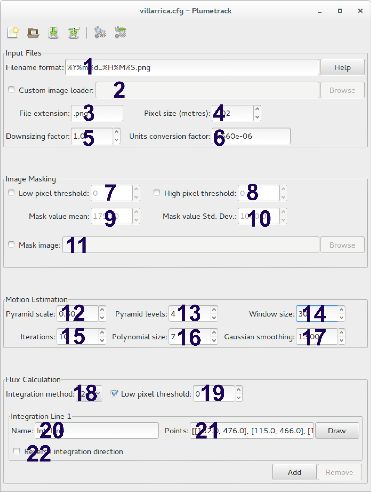

.. _section_configuration:

Configuration
=============

The Configuration File
----------------------
The parameters that Plumetrack uses for computing fluxes are controlled through the use of a configuration file. The configuration file used for a particular run of the program can be specified using the *-f* option on the command line. For example::
    
    plumetrack -f my_config.cfg example_images

will process all of the images in the example_images folder using the settings stored in the my_config.cfg file. This allows multiple configurations to be stored for different situations (for example for processing images from different cameras).

.. note::
  
  If you do not specify a configuration file using the *-f* option, then Plumetrack will use the default configuration file. This may not be what you want!

The configuration file itself is a JSON file (JavaScript Object Notation). Full details of the JSON format can be found `here <http://json.org/>`_. Plumetrack configuration files consist of a single collection of name/value pairs (equivalent to a dict in Python). A default configuration file will have been created during installation of Plumetrack, and it is recommended to use this as a template for customised configurations. The default configuration file can be found in the My Documents\\plumetrack folder on Windows and ~/.plumetrack folder on Linux systems.

The plumetrack-gui Program
-----------------------------
By far the easiest way to configure Plumetrack is using the graphical user interface (the plumetrack-gui program). See :ref:`section_gui_quickstart` for details of how to use this program. This allows the effects of changing different configuration options to be viewed in realtime. Since there is a certain amount of trial and error involved in creating a successful configuration file this is an important feature! Note that the configuration files created with the GUI can then be used with the command-line version of Plumetrack.
  
As well as the .cfg configuration files, every output file produced by Plumetrack contains a copy of the configuration used to create it. Results files may therefore be used interchangably with configuration files (results files can even be passed to the Plumetrack program as configuration files using the ``-f`` option).

Configuration Options
---------------------
All of the following options *must* be declared in the configuration file, their corresponding inputs in the GUI are shown in the annotated screenshot below. More information about the Farneback algorithm parameters can be found in the `OpenCV documentation <http://docs.opencv.org/trunk/modules/video/doc/motion_analysis_and_object_tracking.html?highlight=farneback#cv2.calcOpticalFlowFarneback>`_.

.. _date/time format specifiers: https://docs.python.org/2/library/datetime.html#strftime-strptime-behavior

+-----------------------------------+-----------+---------+-----------------------------------------------------------------------------------+
| Name                              | GUI Input | Type    | Description                                                                       |
+===================================+===========+=========+===================================================================================+
| **filename_format**               |           | String  | The format of the filenames of the images you want to process (including the file |
|                                   |           |         | extension). The filenames must contain the capture times of the images. The       |
|                                   |           |         | format is specified using the Python `date/time format specifiers`_.              |
+-----------------------------------+-----------+---------+-----------------------------------------------------------------------------------+
| **file_extension**                |           | String  | The filename extension used for the image files e.g. `".png"`.                    |
+-----------------------------------+-----------+---------+-----------------------------------------------------------------------------------+
| **motion_pix_threshold_low**      |           | Float   | Any pixels that are below this threshold will be masked using random noise and    |
|                                   |           |         | will be excluded from the flux calculation. Set to -1.0 to prevent low-value      |
|                                   |           |         | thresholding. Note that the threshold refers to the pixel values in the raw image.|
+-----------------------------------+-----------+---------+-----------------------------------------------------------------------------------+
| **motion_pix_threshold_high**     |           | Float   | Any pixels that are above this threshold will be masked using random noise and    |
|                                   |           |         | will be excluded from the flux calculation. Set to -1.0 to prevent high-value     |
|                                   |           |         | thresholding. Note that the threshold refers to the pixel values in the raw image.|
+-----------------------------------+-----------+---------+-----------------------------------------------------------------------------------+
| **random_mean**                   |           | Float   | Masked pixels (either due to thresholding or a mask image) are replaced by        |
|                                   |           |         | Gaussian distributed white noise. This parameter controls the mean value of this  |
|                                   |           |         | noise.                                                                            |
+-----------------------------------+-----------+---------+-----------------------------------------------------------------------------------+
| **random_sigma**                  |           | Float   | Masked pixels (either due to thresholding or a mask image) are replaced by        |
|                                   |           |         | Gaussian distributed white noise. This parameter controls the standard-deviation  | 
|                                   |           |         | of this  noise.                                                                   |
+-----------------------------------+-----------+---------+-----------------------------------------------------------------------------------+
| **mask_image**                    |           | String  | Regions of the image which you do not want to contribute to the flux, or that     |
|                                   |           |         | might interfere with the motion estimation (for example high-contrast boudaries   |
|                                   |           |         | of the volcanic edifice) can be excluded from the calculations by creating a mask |
|                                   |           |         | image. This should be a greyscale image of the same size as the UV images to be   |
|                                   |           |         | processed. Any pixels that are black (pixel value of 0) in the mask image will be |
|                                   |           |         | replaced with random noise and excluded from the flux calculations. Set this to   |
|                                   |           |         | an empty string if you do not wish to use a mask image.                           |
+-----------------------------------+-----------+---------+-----------------------------------------------------------------------------------+
| **pixel_size**                    |           | Float   | The size (either the width or the height) of the pixels in the images in meters.  |
|                                   |           |         | Note that this is *not* the area of the pixels.                                   |
+-----------------------------------+-----------+---------+-----------------------------------------------------------------------------------+
| **downsizing_factor**             |           | Float   | Computation time scales approximately linearly with the number of pixels in the   |
|                                   |           |         | images. Large speed increases can therefore be achieved by downscaling the images |
|                                   |           |         | prior to computing the flux. Setting the this parameter to a value >1.0 will      |
|                                   |           |         | result in the images being scaled/resized (e.g. if downsizing_factor=2.0, then    |
|                                   |           |         | images will be halved in size) by this amount prior to be processed. This will    |
|                                   |           |         | increase the speed of computation, but will result in coarser flux estimates.     |
+-----------------------------------+-----------+---------+-----------------------------------------------------------------------------------+
| **flux_conversion_factor**        |           | Float   | This is used in conjunction with the pixel_size parameter to convert              |
|                                   |           |         | the pixel values in your images into SO2 masses. You need to select a value for   |
|                                   |           |         | this parameter such that `SO2_mass = pixel_value x pixel_size^2 x                 |
|                                   |           |         | flux_conversion_factor`. The fluxes returned will then have units of              |
|                                   |           |         | SO2-mass-units per second.                                                        |
+-----------------------------------+-----------+---------+-----------------------------------------------------------------------------------+
| **farneback_pyr_scale**           |           | Float   | Farneback algorithm parameter: the image scale (<1.0) to build pyramids for each  |
|                                   |           |         | image; ``farneback_pyr_scale=0.5`` means a classical pyramid, where each next     |
|                                   |           |         | layer is twice smaller than the previous one.                                     |
+-----------------------------------+-----------+---------+-----------------------------------------------------------------------------------+
| **farneback_levels**              |           | Integer | Farneback algorithm parameter: number of pyramid layers including the initial     |
|                                   |           |         | image; ``farneback_levels=1`` means that no extra layers are created and only the |
|                                   |           |         | original images are used.                                                         |
+-----------------------------------+-----------+---------+-----------------------------------------------------------------------------------+
| **farneback_winsize**             |           | Integer | Farneback algorithm parameter: averaging window size; larger values increase the  |
|                                   |           |         | algorithm robustness to image noise and give more chances for fast motion         |
|                                   |           |         | detection, but yield more blurred motion field.                                   |
+-----------------------------------+-----------+---------+-----------------------------------------------------------------------------------+
| **farneback_iterations**          |           | Integer | Farneback algorithm parameter: number of iterations the algorithm does at each    |
|                                   |           |         | pyramid level.                                                                    |
+-----------------------------------+-----------+---------+-----------------------------------------------------------------------------------+
| **farneback_poly_n**              |           | Integer | Farneback algorithm parameter: size of the pixel neighborhood used to find        |
|                                   |           |         | polynomial expansion in each pixel; larger values mean that the image will be     |
|                                   |           |         | approximated with smoother surfaces, yielding more robust algorithm and more      |
|                                   |           |         | blurred  motion field, typically ``farneback_poly_n`` =5 or 7.                    |
+-----------------------------------+-----------+---------+-----------------------------------------------------------------------------------+
| **farneback_poly_sigma**          |           | Float   | Farneback algorithm parameter: standard deviation of the Gaussian that is used to |
|                                   |           |         | smooth derivatives used as a basis for the polynomial expansion; for              |
|                                   |           |         | ``farneback_poly_n=5``, you can set ``farneback_poly_sigma=1.1``, for             |
|                                   |           |         | ``farneback_poly_n=7``, a good value would be ``farneback_poly_sigma=1.5``.       |
+-----------------------------------+-----------+---------+-----------------------------------------------------------------------------------+
| **integration_method**            |           | String  | The integration method may be either '1d' or '2d'. The '1d' method computes flux  |
|                                   |           |         | by multiplying each pixel on the the integration line by its corresponding        |
|                                   |           |         | velocity and then integrating along the line's length. The '2d' method considers  |
|                                   |           |         | every pixel in the image and its corresponding velocity to compute which regions  |
|                                   |           |         | of the image cross the integration line between frames. The '1d' method is        |
|                                   |           |         | marginally faster, but the '2d' method is more robust, especially for images      | 
|                                   |           |         | which have large time gap between them, or for highly dynamic plumes.             |
+-----------------------------------+-----------+---------+-----------------------------------------------------------------------------------+
| **integration_pix_threshold_low** |           | Float   | Any pixels that are below this threshold will be excluded from the flux           |
|                                   |           |         | calculation. However, it does not change the visibility of the pixels to the      |
|                                   |           |         | motion estimtion algorithm (unlike the thresholds above).                         |
+-----------------------------------+-----------+---------+-----------------------------------------------------------------------------------+
| **integration_lines**             |           | List    | List of dicts of integration line parameters, one for each integration line. See  |
|                                   |           |         | table below for details of what integration line parameters must be set.          |
+-----------------------------------+-----------+---------+-----------------------------------------------------------------------------------+

Integration line configuration parameters:

+-----------------------------------+-----------+---------+-----------------------------------------------------------------------------------+
| Name                              |           | Type    | Description                                                                       |
+===================================+===========+=========+===================================================================================+
| **name**                          |           | String  | A descriptive name to identify the integration line. This will appear as a column |
|                                   |           |         | heading in results files.                                                         |
+-----------------------------------+-----------+---------+-----------------------------------------------------------------------------------+
| **integration_points**            |           | List    | A list of [x, y] points (e.g. [[x1, y1], [x2, y2],...] defining the integration   |
|                                   |           |         | line for the flux calculation. x and y are in pixel coordinates - the origin is in|
|                                   |           |         | the top left of n image.                                                          |
+-----------------------------------+-----------+---------+-----------------------------------------------------------------------------------+
| **integration_direction**         |           | Integer | Either 1 or -1. Defines which way is positive across the integration line. The    |
|                                   |           |         | positive direction is defined as the cross-product of a unit vector with          |
|                                   |           |         | `integration_direction` sign along the z-axis with a vector along the integration |
|                                   |           |         | line.                                                                             |
+-----------------------------------+-----------+---------+-----------------------------------------------------------------------------------+

