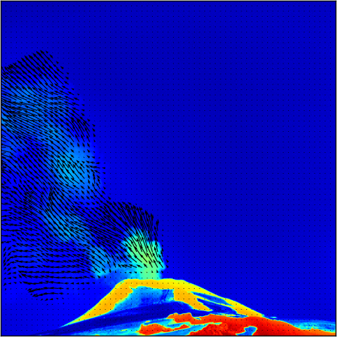

.. Plumetrack documentation master file, created by
   sphinx-quickstart on Tue Sep  2 17:38:48 2014.
   You can adapt this file completely to your liking, but it should at least
   contain the root `toctree` directive.

Welcome to Plumetrack's documentation!
======================================

Plumetrack is a `Python <http://www.python.org>`_ program for computing sulphur dioxide fluxes from SO2 camera data. It does *not* perform image calibration into SO2 column amounts. Instead it uses optical flow to calculate the velocity field between pre-calibrated images and allows integrations to be performed across arbitrary paths in the images to compute fluxes.

It is designed with volcanic monitoring in mind and can perform both real-time and batch processing of images. In addition to SO2 camera images, Plumetrack can be used to compute the motion field for any arbitrary sequence of images. This makes it a useful tool for estimating plume rise speed from video footage for example for DOAS-based flux calculations.

Plumetrack can be used from the command-line, to facilitate easy integration with existing UV image processing toolchains and simple automation of flux calculations. It also ships with a graphical user interface which allows program settings to be adjusted whilst viewing in realtime the effects that the changes have on the computed motion field. This makes configuration of flux calculations relatively straightforward, and allows use of the majority of the program's features without needing to type magic runes at a command prompt.

Contents:

.. toctree::
   :maxdepth: 2
   
   installation
   quickstart_gui
   quickstart_cmdline
   configuration
   loading_images
   
   
   
.. toctree::
   :maxdepth: 1
      
   API

Indices and tables
==================

* :ref:`genindex`
* :ref:`modindex`
* :ref:`search`

