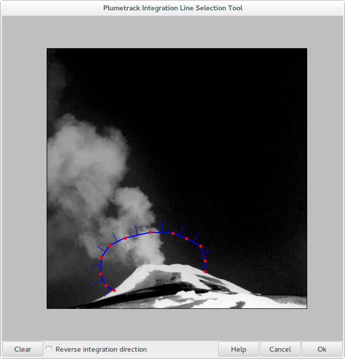

.. _section_gui_quickstart:

Quickstart - Graphical User Interface
=====================================

The Plumetrack distribution includes a few example images of Villarrica volcano in Chile along with an example configuration file, so that you can quickly get used to using the program. The following tutorial will guide you through processing these example images using the graphical version of Plumetrack. If you do not have the example files (they are in the examples folder of the source distribution) then you can download them seperately as a zip file `here <http://ccpforge.cse.rl.ac.uk/gf/project/plumetrack/frs>`_.

To start, open the Plumetrack graphical interface either by clicking on the icon in your Start menu (or applications menu for Linux users) or by running the command `plumetrack-gui` at the commandline. A window similar to the one shown below should open.

This window shows all the configuration options for Plumetrack. At the moment it is just filled with some default values. For this example we want to use the configuration file that comes with the example images, so click on the open button on the toolbar (top left), navigate to the Plumetrack examples folder and select the villarrica.cfg file to open.

.. note::

  When you process images using Plumetrack, a copy of the configuration options used is written to the results file. These settings can be imported back into the program (for example if you want to use the same configuration for a different set of images) by opening the results file in the same way you would a configuration (.cfg) file.

The configuration options from the villarrica.cfg file should now be loaded and displayed in the window. From here, they can be edited and saved back to the file using the save button on the toolbar, or to a different file using the save-as button.

Before we continue, lets change the line accross which we want to compute the flux, the integration line. To do that, click on the "Draw" button next to "Integration Line 1" in the bottom right of the window. You should be asked to select an image that you want to use to draw the intergration line. Select one of the images in the examples/villarrica folder (it doesn't matter which one you pick). A drawing dialog similar to the one below should open.

The integration line (the line across which the flux will be calculated) is shown in blue, with its vertices highlighted in red. The tick marks on the line denote the positive flux direction and this can be changed using the `Reverse integration direction` checkbox at the bottom. Vertices are added to the end of the line by left-clicking on the image and any individual vertex can be removed by right-clicking on it. To remove all the current vertices, click on the `Clear` button in the bottom right of the window. Once you are happy with your choice of integration line click `Ok`. The drawing dialog will close, and the points that you have chosen will be listed in the `Points` box in the format `[[x1, y1], [x2, y2], ...]`- you can also use this box to edit your integration line, but normally it is easier just to draw the points.

You can define as many integration lines as you wish. Additional integration lines are created by clicking on the `Add` button in the bottom right of the main window.

Now lets see what the motion fields being calculated look like. Click on the `Interactive viewer` button in the toolbar (highighted below).

.. image:: _static/interactive_viewer_button.png
   :width: 400px

You will be prompted to select a folder containing images. Select the `villarrica` folder in the Plumetrack examples folder. Once you select the folder, a new window will open similar to the one shown below.

.. image:: _static/interactive_viewer.png
   :width: 400px 

In this window the computed motion field for a particular image is plotted. The filelist on the left hand side shows all the images in the folder and you can use this to scroll through the images and see the computed velocities for each. The sliders at the bottom of the window allow you to adjust how the velocities are plotted. Note that the sliders do not affect how the velocities are computed, only their visualisation.

With the interactive viewer window open, try changing the configuration parameters in the main window and see the effect that they have on the computed motion field. For example, try setting the `Window size` parameter to 50. Note that you either need to press enter, or click in a different settings box in order for the velocity field to be recomputed.

.. note::

  The realtime display of the motion field requires the recomputation of the motion field each time a parameter is changed. On old hardware, or for very large images this may be rather slow, making the program unresponsive. Increasing the downsizing factor will help to improve performance - but keep in mind that this will also affect the accuracy of the plotted motion field.
  
Once you are happy with your configuration, save it to a new file using the `Save as` button in the toolbar. Close the interactive viewer and click on the `Batch process` button in the toolbar (immediately to the right of the `Interactive viewer` button). Select the `villarrica` folder as the Image folder, and choose any filename you like for the Results file (this will be a plain text file so you might want to give it a .txt extension). When you are done, click `Ok`. Plumetrack will compute the fluxes accross the integration line(s) you defined in your configuration for all the images in the `villarrica` folder and write them to the results file that you specified (along with their associated error). Easy! Now try having a play with your own images.
